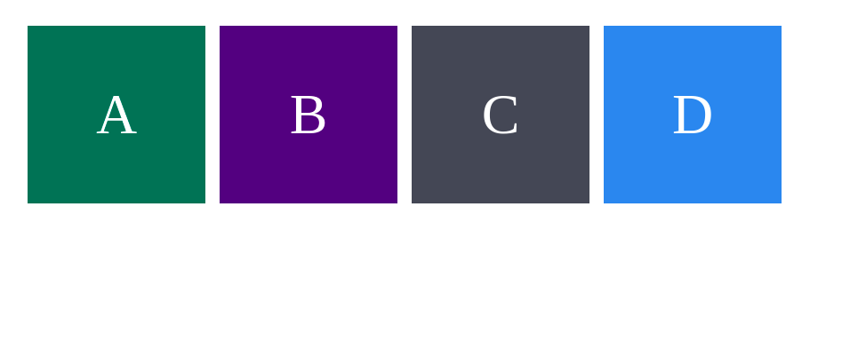
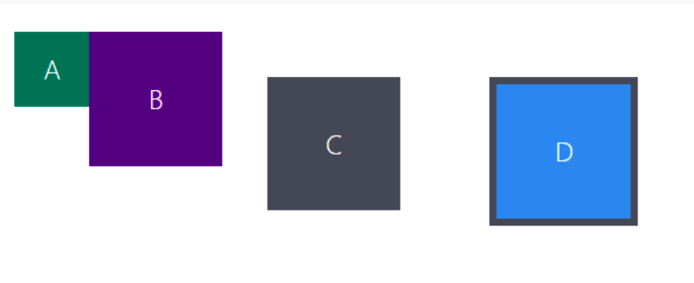
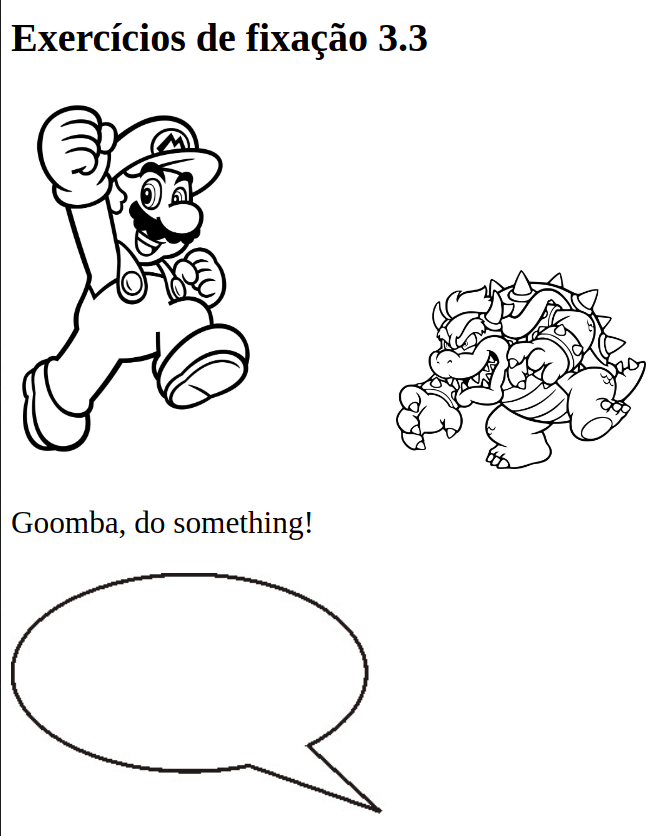
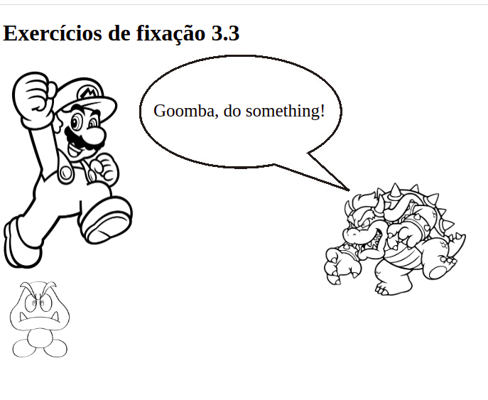

## 3.3 - HTML & CSS - Seletores e posicionamento
Na aula de hoje do curso da Trybe, aprendemos sobre os seletores de posicionamento no CSS, como combinar e agrupar os seletores da melhor forma possível,
e também sobre o conceito de "box model", que ensina como os elementos html se relacionam visualmente e como posicionar cada elemento.

**Foram realizados diversos exercícios hoje, os arquivos de cada um estão em pastas separadas, aqui vou descrever os requisitos de cada um e o resultado final esperado:**

#### Exercício 1 - Box Model
  * Situação inicial:

  </img>
  

  
  * Resultado Esperado:

  </img>

#### Exercício 2 - Posicionamento de Elementos

 * Situação inicial:

  </img>
 
  
  * Resultado Esperado:
 
  </img>
  
  #### Exercício 3 - Agrupamento de Seletores e Pseudoclasses em CSS
  * Exercícios Realizados:
1. Adicione uma lista ordenada dos 3 melhores sites que você conhece.
2. Crie um arquivo no mesmo diretório e nomeie-o de 'style.css'.
3. Nesse arquivo .css, adicione os estilos para que:
   - O texto das tags 'h1' e 'p' estejam centralizados.
   - A cor de fundo da sua lista mude quando o cursor estiver sobre o item.
   - A fonte do item mude quando ele for clicado.
4. Adicione uma lista não ordenada com, pelo menos, 3 características que você gosta.
5. No 'style.css', adicione a propriedade 'list-style: none' para ambas as listas.

  #### Exercício 4 - Agrupamento de Seletores e Pseudoclasses em CSS
  * Para o próximo exercício, não foi atribuido nenhuma classe ou id aos componentes, apenas utilizado pseudoclasses para individualizar cada elemento!
  * Exercícios Realizados:
1. Estilize as divs para que, ao passar o cursor por cima das mesmas, elas ganhem uma borda.
2. Faça cada div ter uma cor própria.
3. Estilize cada uma das tags h3.
4. Faça a terceira div ser maior que as demais.
5. Deixe as tags ímpares h3 com o texto em itálico.
