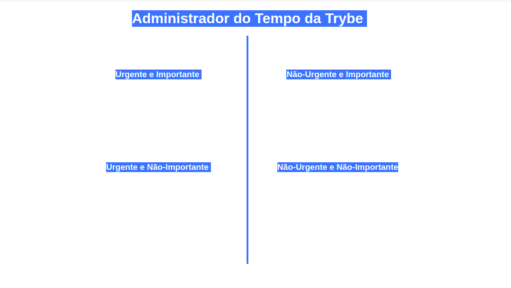

# Exercícios dia 5.1 - JavaScript - DOM e seletores
Neste dia no curso da trybe aprendemos sobre o DOM e seus diversos tipos seletores, e como podemos manipular os elementos html utilizando o DOM e o JavaScript.
O primeiro exercício realizado tinha como desafio utilizar o DOM na seguinte página:
</img>
